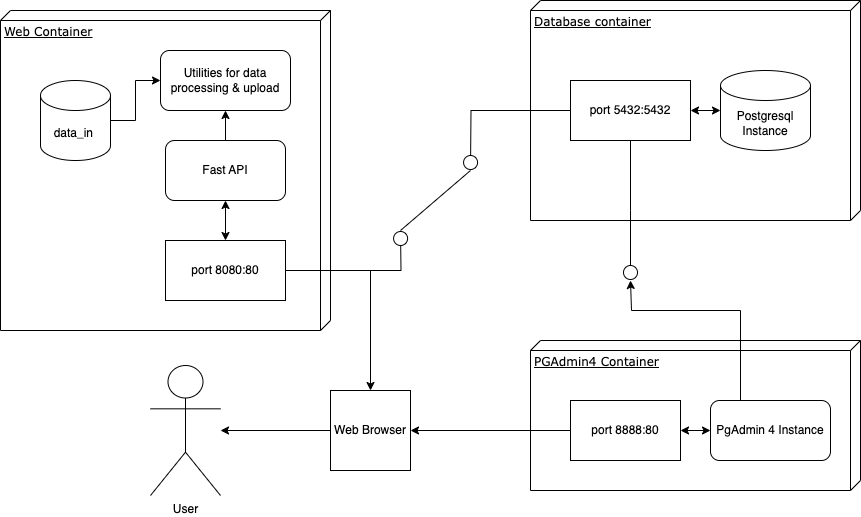
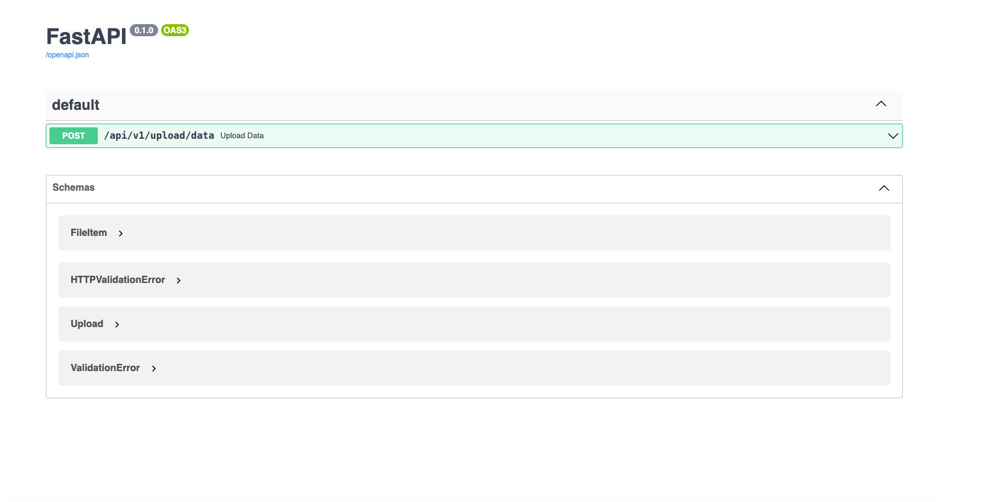
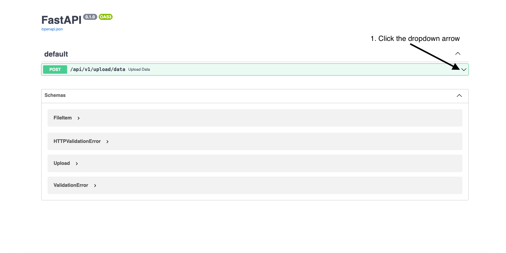
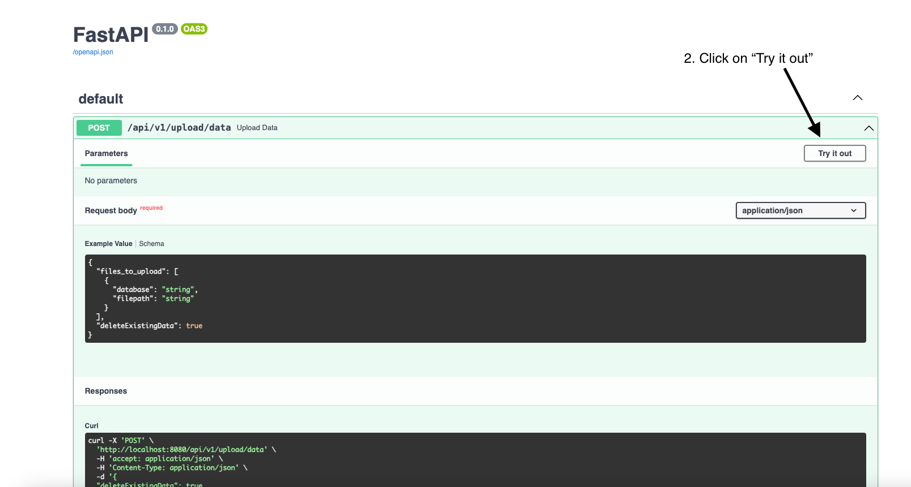
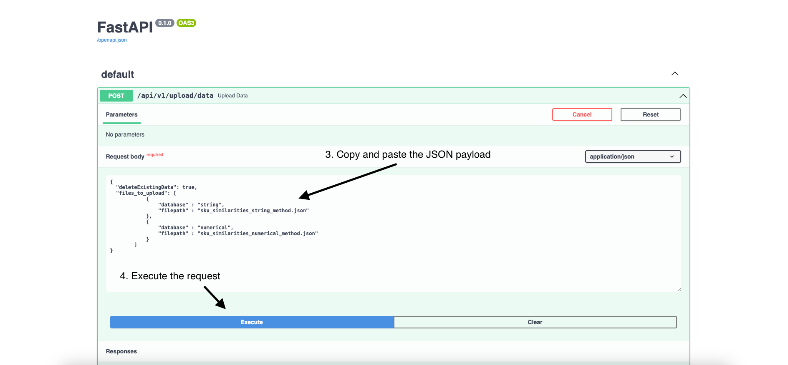
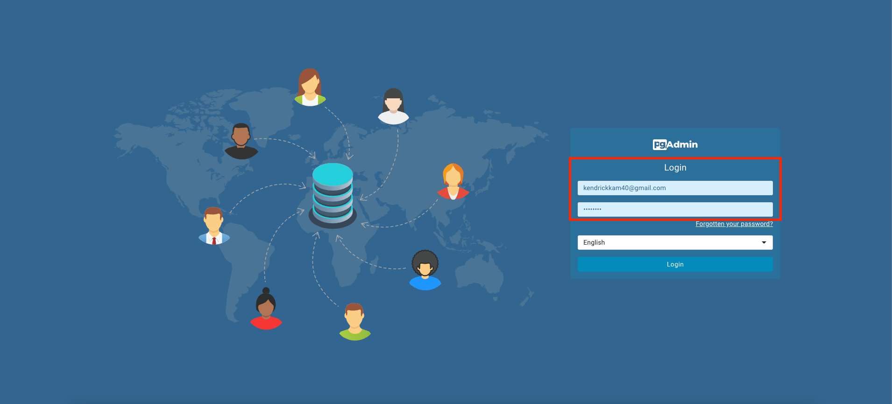

# Technical challenge - Kendrick

The following document outlines the architecture, process and setup instructions for the technical challenge

## Architecture

This project structured into three containers, each serving a distinct purpose within the system architecture. These containers are:

- Web Container: This container hosts the FastAPI web application along with Python scripts for data processing. It also contains essential data files required for processing.

- DB Container: This container houses the PostgreSQL database instance, which connects to the FastAPI web application. It is configured with specific credentials and port mappings.

- PGAdmin4 Container: This container encompasses the PGAdmin instance, facilitating database exploration and management. It provides a user-friendly interface to interact with the PostgreSQL database.



### 1. Container: Web

The web container contains the FastAPI web application, the Python scripts to process the data, the data_in folder that contains the 2 json files.

The file structure that houses the web application in the container is as follows:

```
├── code
│   ├── app
│   │   ├── main.py
│   │   ├── __init__.py
│   │   ├── utilities
│   │   │   ├── __init__.py
│   │   │   ├── .env
│   │   │   ├── connector.py
│   │   │   ├── process_data.py
│   │   │   ├── setup.py
│   ├── data_in
│   │   ├── sku_similarities_numerical_method.json
│   │   ├── sku_similarities_string_method.json
│   ├── Dockerfile
│   ├── compose.yml
│   ├── solution_dump.sql
│   ├── requirements.txt
│   ├── README.md
```

### 2. Container: db

Houses the postgresql database instance that will connect to the FastAPI web application.
This data base is setup with the following details:

```
POSTGRES_USER: admin
POSTGRES_PASSWORD: admin123
POSTGRES_DB: mydatabase
Port_Mapping -> 5432:5432
```

### 3. Container: pgadmin4_container

This container contains the PGADMIN instance to explore the database. To launch the UI, navigate to localhost:8888 and login with the following credentials:

```
PGADMIN_DEFAULT_EMAIL: kendrickkam40@gmail.com
PGADMIN_DEFAULT_PASSWORD: admin123
```

## Setup/Installation
Execute the docker-compose.yml file to initiate the containers. This command ensures all three containers—web, DB, and PGAdmin—are up and running.

Run the docker compose.yml file using the following command:

```bash
  docker compose up
```
Verify using docker ps OR docker desktop that the following 3 containers are running:
- web
- db
- pgadmin4_container

## Configuiring the .env file (Optional)

Optionally, modify the .env file to customize connection details for the PostgreSQL database.

Go to the project directory

```bash
  cd technical_test_developer
```

navigate to the app/utilities folder

```bash
  cd ./app/utilities
```

Open the .env file and if needed, change the db_* enviornment variables to suit your postgresql database.

In this example, the following details are set:
```
db_host = "db" # DO NOT CHANGE THIS UNLESS YOU NEED TO CHANGE THE POSTGRES CONTAINER NAME
db_port = "5432"
db_database = "mydatabase"
db_user = "admin"
db_password = "admin123"
db_schema = "mytest"
data_file_path="./data_in"
```

## The Task
The primary task involves completing specific functionalities within the FastAPI web application. Detailed instructions are provided to executethe required operations via the FastAPI documentation interface.


Navigate to the FastAPI docs link via the following url:
```
http://localhost:8080/docs
```


To complete the functionality in Q4, run the upload data POST method by:

1. click the dropdown arrow



2. click Try it out



3. Copy and paste the following JSON payload:
```
{
  "deleteExistingData": true,
  "files_to_upload": [
            {
                "database" : "string",
                "filepath" : "sku_similarities_string_method.json"
            },
            {
                "database" : "numerical",
                "filepath" : "sku_similarities_numerical_method.json"
            }
        ]
}
```
4. Execute the request



To verify that the data is uploaded, navigate to the following url to launch the PGADMIN UI
```
http://localhost:8888
```

Login with the following credentials:
```
PGADMIN_DEFAULT_EMAIL: kendrickkam40@gmail.com
PGADMIN_DEFAULT_PASSWORD: admin123
```


Register a new server with the following details
```
Name: test_db
Host: db
Port: 5432
Username: admin
Password: admin123
```


You can now navigate to test_db -> Databases -> mydatabase -> schemas -> mytest -> Tables to launch the query tool and view the data


## Run tests

Unit tests are available within the project's tests folder to ensure the integrity and functionality of the system. Users can execute these tests within the web application container's terminal using the provided Python command.

To run the unit tests in the tests folder,  first launch the web app containers terminal

```
docker exec -it technical-challenge-web-1 /bin/bash
```

Execute the following python command

```
python run_tests.py
```