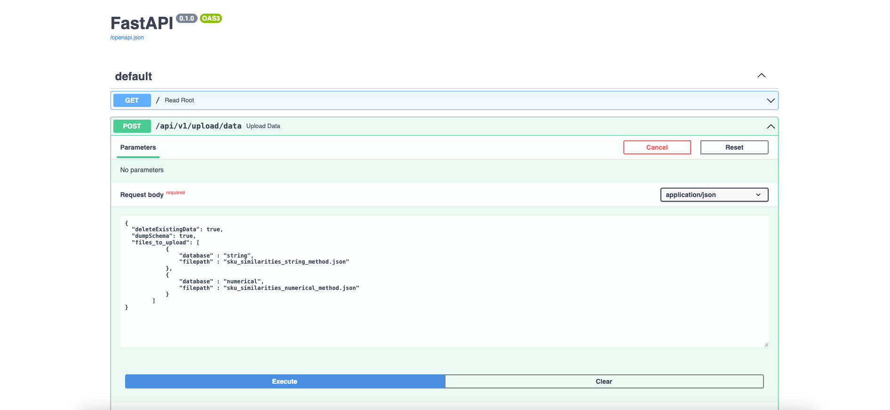
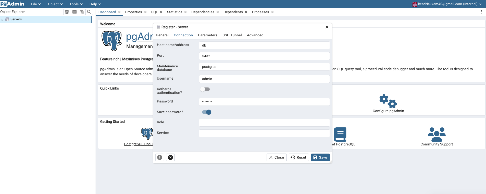
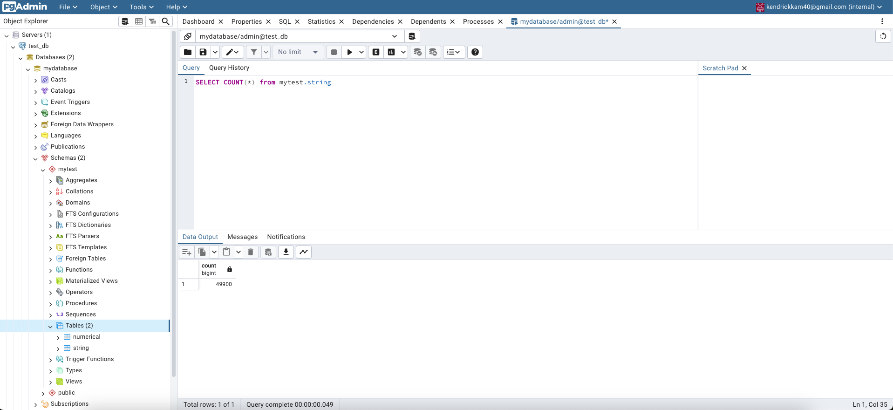

# Technical challenge - Kendrick

The following document outlines the architecture, process and setup instructions for the technical challenge


## Setup/Installation

Run the docker compose.yml file

```bash
  docker compose up -d
```
Verify using docker ps OR docker desktop that the following 3 containers are running:
- web
- db
- pgadmin4_container

## Configuiring the .env file

Go to the project directory

```bash
  cd technical_test_developer
```

navigate to the app/utilities folder

```bash
  cd ./app/utilities
```

Open the .env file and if needed, change the db_* enviornment variables to suit your postgresql database.

In this example, the following details are set:
```
db_host = "db" # DO NOT CHANGE THIS UNLESS YOU NEED TO CHANGE THE POSTGRES CONTAINER NAME
db_port = "5432"
db_database = "mydatabase"
db_user = "admin"
db_password = "admin123"
db_schema = "mytest"
data_file_path="./data_in"
```
## Architecture

3 containers will be created upon executing the docker compose command.

### 1. Container: Web

The web container contains the FastAPI web application, the Python scripts to process the data, the data_in folder that contains the 2 json files.

The file structure that houses the web application in the container is as follows:

```
├── code
│   ├── app
│   │   ├── main.py
│   │   ├── __init__.py
│   │   ├── utilities
│   │   │   ├── __init__.py
│   │   │   ├── .env
│   │   │   ├── connector.py
│   │   │   ├── process_data.py
│   │   │   ├── setup.py
│   ├── data_in
│   │   ├── sku_similarities_numerical_method.json
│   │   ├── sku_similarities_string_method.json
│   ├── Dockerfile
│   ├── compose.yml
│   ├── solution_dump.sql
│   ├── requirements.txt
│   ├── README.md
```

### 2. Container: db

Houses the postgresql database instance that will connect to the FastAPI web application.
This data base is setup with the following details:

```
POSTGRES_USER: admin
POSTGRES_PASSWORD: admin123
POSTGRES_DB: mydatabase
Port_Mapping -> 5432:5432
```

### 3. Container: pgadmin4_container

This container contains the PGADMIN instance to explore the database. To launch the UI, navigate to localhost:8888 and login with the following credentials:

```
PGADMIN_DEFAULT_EMAIL: kendrickkam40@gmail.com
PGADMIN_DEFAULT_PASSWORD: admin123
```

## The Task
Navigate to the FastAPI docs link via the following url:
```
http://localhost:8080/docs
```

To complete the functionality in Q4, run the upload data POST method by:
1. click the dropdown arrow
2. click Try it out
3. Copy and paste the following JSON payload:
```
{
  "deleteExistingData": true,
  "dumpSchema": false,
  "files_to_upload": [
            {
                "database" : "string",
                "filepath" : "sku_similarities_string_method.json"
            },
            {
                "database" : "numerical",
                "filepath" : "sku_similarities_numerical_method.json"
            }
        ]
}
```
4. Execute the request



To verify that the data is uploaded, navigate to the following url to launch the PGADMIN UI
```
http://localhost:8888
```

Login with the following credentials:
```
PGADMIN_DEFAULT_EMAIL: kendrickkam40@gmail.com
PGADMIN_DEFAULT_PASSWORD: admin123
```
Register a new server with the following details
```
Name: test_db
Host: db
Port: 5432
Username: admin
Password: admin123
```



You can now navigate to test_db -> Databases -> mydatabase -> schemas -> mytest -> Tables to launch the query tool and view the data




## Run tests

To run the unit tests in the tests folder, run the run_tests.py command

```
python run_tests.py
```